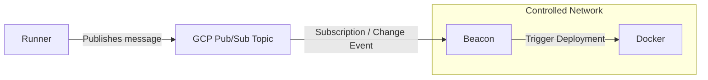

# Beacon

Beacon is a simple tool to watch for Docker deployment notification in CI/CD workflow - designed for machines under controlled networks.



## Setup

### Prerequisites

**1. GCP Authentication**

- Option 1: Using [Application Default Credentials (ADC)](https://cloud.google.com/docs/authentication/application-default-credentials)

```bash
gcloud auth application-default login
```

- Option 2: set `GOOGLE_APPLICATION_CREDENTIALS` environment variable to the path of a service account key file:
```bash
export GOOGLE_APPLICATION_CREDENTIALS="/path/to/service-account-key.json"
```

**NOTE: The credentials must have access to each Pub/Sub subscription declared in the configuration**

For example, to grant IAM policy to a specific subscription ID, execute the following command after replacing `my-subscription-id`, `my-project-id` and `my-service-account` placeholders

```bash
gcloud pubsub subscriptions add-iam-policy-binding my-subscription-id \
  --project="my-project-id" \
  --member="serviceAccount:my-service-account@my-project-id.iam.gserviceaccount.com" \
  --role="roles/pubsub.subscriber"
```

**2. Create a configuration file**

Create a `config.yml` file. See the [Configuration](#configuration) section below for all available options.

**3. Build the binary (if running from source)**

```bash
go build -o beacon .
```

---

### VM-hosted

Grant Docker access to the user running Beacon, then run the binary with your config file.

- Option 1: Add the current user to the `docker` group
```bash
sudo usermod -aG docker $USER
newgrp docker

./beacon -config config.yml
```

- Option 2: Run as root
```bash
sudo ./beacon -config config.yml
```

---

### Docker

```bash
docker run \
  -v ./config.yml:/app/config.yml:ro \
  ghcr.io/anhcraft/beacon:main -config /app/config.yml
```

View all prebuilt images at: https://github.com/anhcraft/beacon/pkgs/container/beacon

## Configuration
```yaml
# One GCP project is supported per app instance
gcp-project-id: "your-project-id"

# Define multiple consumers
consumers:
  my-topic-consumer: # Any ID you want
    # Your service account must have access to this subscription
    pubsub-subscription-id: "your-subscription-id"

    deduplication:
      enabled: false
      
      # When enabled, deployment messages within a 5-minute window results in a single deployment trigger
      time-window: "5m"
    
    trigger-commands:
      - 'echo "Triggering Docker deployment..."'
      - 'docker stack deploy --with-registry-auth -c docker-compose.yml myapp'
```
