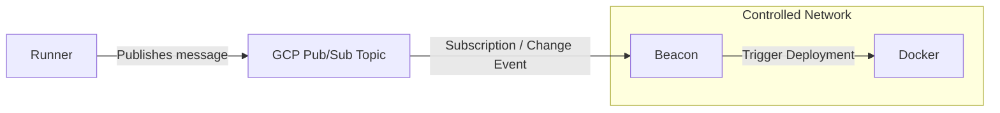

# Beacon

Beacon is a simple tool to watch for Docker deployment notification in CI/CD workflow - designed for machines under controlled networks.



## I. Installation

### Option 1: Installer (for Linux/amd64 and macOS/arm64)

```bash
curl -fsSL https://raw.githubusercontent.com/anhcraft/beacon/refs/heads/main/install-beacon.sh | sudo bash
```

Locations:
- Path to the binary: `/usr/local/bin/beacon`
- Path to the config (**required**, see below): `/etc/beacon/config.yml`
- Path to the GCP Credentials (optional, see below): `/etc/beacon/gcp_credentials.json`

The script installs Beacon as systemd service, you can start the service **after configuring /etc/beacon/config.yml** using this command:
```bash
systemctl start beacon
```

To inspect the logs:
```bash
journalctl -u beacon -f
```

### Option 2: Docker container (for Linux/amd64)

- Create the config `config.yml` (see below) then run
```bash
docker run \
  -v ./config.yml:/app/config.yml:ro \
  ghcr.io/anhcraft/beacon:latest -config /app/config.yml
```

View all prebuilt images at: https://github.com/anhcraft/beacon/pkgs/container/beacon

### Option 3: Build from source

- Build the app:
```bash
go build -o beacon .
```

- Run as root:
```bash
sudo ./beacon -config config.yml
```

## II. GCP Authentication

Since Beacon uses GCP Pub/Sub, it needs access granted via service accounts.

### 1. Prerequisites

- **Recommended**: Create a specialized service account for Beacon and **only** grant access to certain Pub/Sub subscriptions
```bash
gcloud iam service-accounts create beacon-service-account \ 
    --display-name="Beacon" \
    --project="YOUR_PROJECT_ID"

# For each YOUR_SUBSCRIPTION_ID declared in config.yml:
gcloud pubsub subscriptions add-iam-policy-binding YOUR_SUBSCRIPTION_ID \
  --project="YOUR_PROJECT_ID" \
  --member="serviceAccount:beacon-service-account@YOUR_PROJECT_ID.iam.gserviceaccount.com" \
  --role="roles/pubsub.subscriber"

#gcloud pubsub subscriptions add-iam-policy-binding YOUR_SUBSCRIPTION_ID_2 \
#  --project="YOUR_PROJECT_ID" \
#  --member="serviceAccount:beacon-service-account@YOUR_PROJECT_ID.iam.gserviceaccount.com" \
#  --role="roles/pubsub.subscriber"
```

- Alternatively, if you are in development/testing environment then you can quickly log in to your Google account using [Application Default Credentials (ADC)](https://cloud.google.com/docs/authentication/application-default-credentials)

```bash
gcloud auth application-default login
```

### 2. Link Credentials

- If you use [Application Default Credentials (ADC)](https://cloud.google.com/docs/authentication/application-default-credentials), this section could be skipped
- If you used the installer, `/etc/beacon/gcp_credentials.json` is the path to the GCP Application Credentials
- Otherwise, consider using `GOOGLE_APPLICATION_CREDENTIALS` environment variable
```bash
export GOOGLE_APPLICATION_CREDENTIALS="/path/to/service-account-key.json"
```

---

## II. Configuration
```yaml
# One GCP project is supported per app instance
gcp-project-id: "your-project-id"

# Define multiple consumers
consumers:
  my-topic-consumer: # Any ID you want
    # Your service account must have access to this subscription
    pubsub-subscription-id: "your-subscription-id"

    deduplication:
      enabled: false
      
      # When enabled, deployment messages within a 5-minute window results in a single deployment trigger
      time-window: "5m"

    trigger-commands:
      - 'echo "Triggering Docker deployment..."'
      - 'cd /home/ && sudo docker stack deploy --with-registry-auth -c docker-compose.yml myapp'
```
